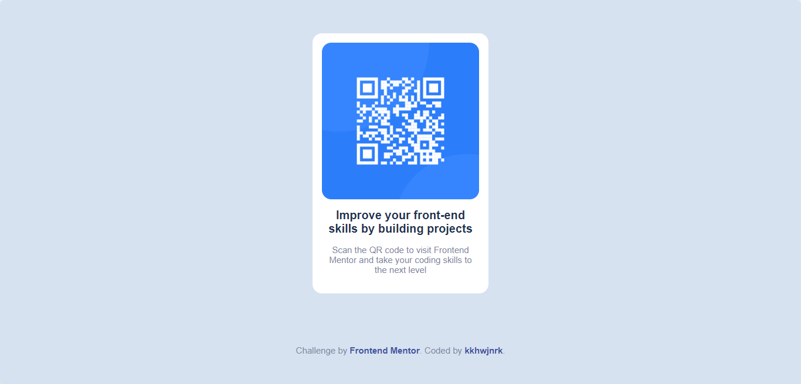

# Frontend Mentor - QR code component

Hello, and welcome to my first challenge on Frontend Mentor! In this challenge, I was tasked with creating a QR code component using HTML and CSS.

### Screenshot 📷
Here is a preview of the QR code component that I created:

### Link 🔗
- Live Site URL: [QR Code Component](https://qr-code-component.kkhwjnrk.vercel.app/)
- Frontend Mentor - [@kkhwjnrk](https://www.frontendmentor.io/profile/kkhwjnrk)
